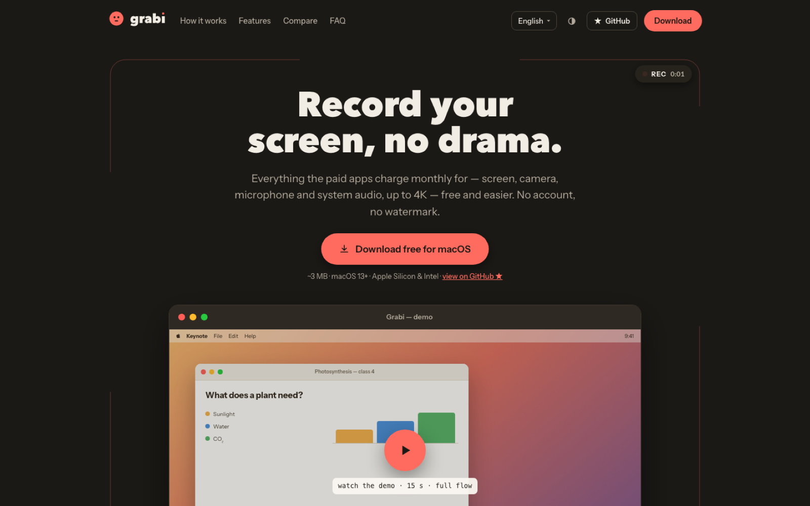
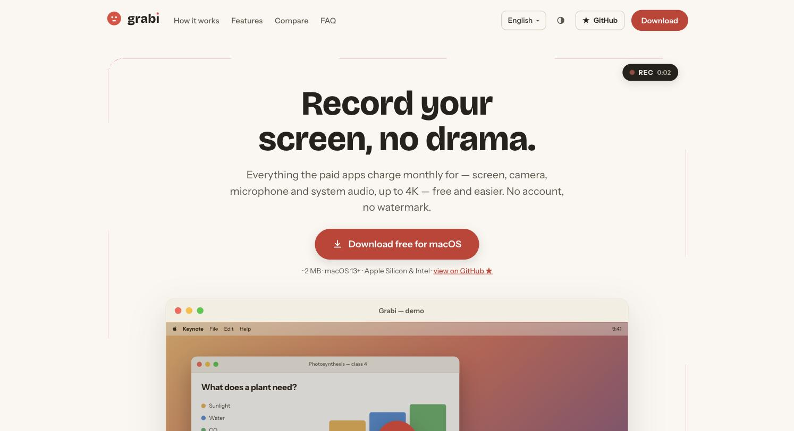
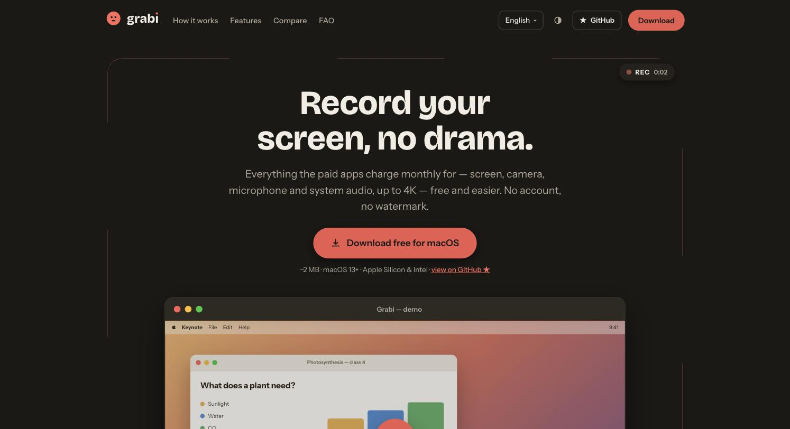
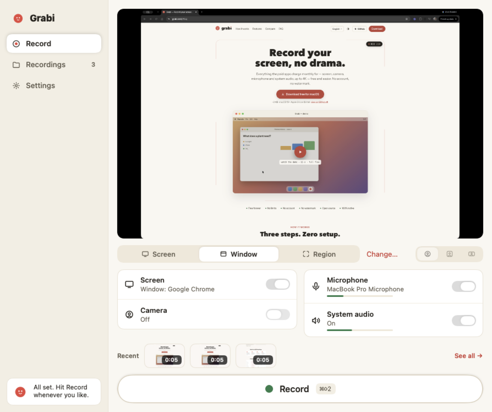

<div align="center">


# grabi-web

### The site behind [grabi.net](https://grabi.net)

The official website for **Grabi** — the free, open-source screen recorder for
macOS made by [Freeloz](https://github.com/freeloz). Static, fast, in five
languages, and honest about what the app can do.

[](https://grabi.net)
[](https://github.com/freeloz/grabi-web/actions/workflows/deploy.yml)


[English](https://grabi.net) · [Español](https://grabi.net/es) · [Português](https://grabi.net/pt) · [Français](https://grabi.net/fr) · [Deutsch](https://grabi.net/de)



</div>

---

## Both themes, on purpose

The palette comes from Grabi's brand manual and lives as CSS custom
properties — light and dark follow `prefers-color-scheme` **and** a manual
toggle, so the visitor always wins.

| Light | Dark |
|---|---|
|  |  |

## What the site is selling

<p align="center">
  
</p>

A 15-second scripted demo in the hero walks through the real flow — pick your
sources, the 3·2·1 countdown, the floating pill, the camera moving live, the
"it's ready" notification — and every claim on the page is one the app
actually keeps. When something is not true yet, the copy changes, not the app.

## Under the hood

| | |
|---|---|
| **[Astro 5](https://astro.build)** | Fully static output. The only JavaScript shipped is three small inline scripts: theme toggle, hero demo, GitHub stars. |
| **Design tokens** | Straight from the approved brand manual, in `src/styles/tokens.css`. Nothing hardcoded outside it. |
| **i18n** | Native Astro routing with `hreflang` and `x-default`; all copy in `src/i18n/`. |
| **Hosting** | Cloudflare Workers static assets, deployed by GitHub Actions on every push to `main`. |
| **Performance** | Self-hosted subset fonts, inlined CSS, no framework runtime — 97/100/100/100 on mobile in production. |

## Where the downloads come from

Releases live on Cloudflare R2 behind **dl.grabi.net**: immutable versioned
DMGs with a published SHA-256 (`/macos/v<version>/…`), a `latest/` pointer, a
`latest.json` manifest and the Sparkle **appcast** (`/macos/appcast.xml`) that
installed apps update from. All of it is regenerated atomically by
[`scripts/publish-release.sh`](https://github.com/freeloz/grabi-macos/blob/main/scripts/publish-release.sh)
in [grabi-macos](https://github.com/freeloz/grabi-macos); this site only reads
`latest.json`.

## Run it locally

```bash
npm install
npm run dev        # http://localhost:4321
npm run build      # static build into dist/
npm run preview    # serve the build
```

No environment variables are needed to develop. Analytics (GA4 / Clarity) only
activate when `PUBLIC_GA4_ID` / `PUBLIC_CLARITY_ID` are present at build time —
see `.env.example`. **Never commit real IDs or tokens.**

```
src/
├── components/   Hero (with the demo), Features, Compare, FAQ, Footer…
├── i18n/         all the copy, one file per language
├── layouts/      Base.astro: metas, hreflang, JSON-LD, theme bootstrap
├── pages/        / · /es · /pt · /fr · /de  +  changelog · press · 404
└── styles/       tokens.css — the brand, as variables
```

## Contributing

Issues and PRs welcome — see [CONTRIBUTING.md](CONTRIBUTING.md). Translation
fixes are especially appreciated: every string lives in `src/i18n/`, and the
Spanish copy plus the brand voice are the source of truth from the approved
design.

## License

[MIT](LICENSE) © Freeloz

---

## En español

Sitio oficial de **Grabi**, el grabador de pantalla gratuito y de código
abierto para macOS: abres, presionas el punto rojo, listo.

- **Correr en local**: `npm install && npm run dev`
- **Textos**: todo el copy vive en `src/i18n/` (5 idiomas). El español y la voz
  de la marca son la fuente de verdad del diseño aprobado.
- **Diseño**: los tokens (colores, tipografía, espaciado) vienen del manual de
  marca y viven en `src/styles/tokens.css` — nada hardcodeado fuera de ahí.
- **Honestidad**: si la web promete algo, la app lo cumple. Cuando no, cambia
  la web.

<div align="center">

**[grabi.net](https://grabi.net)** · hecho con calma por
[Freeloz](https://github.com/freeloz)

</div>
